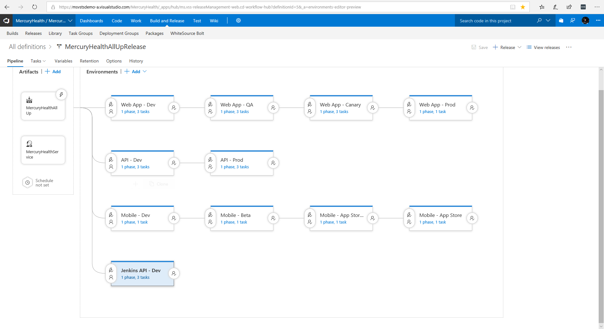
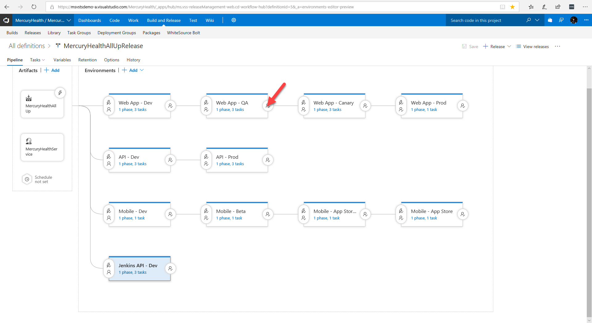

# Demo Setup
## Node.js app in a github repo
The following tabs are available for download as an <a href="chrome_bookmarks.html">export from Chrome</a>. This should make life easier setting up your local environment.

<a href="https://portal.azure.com">Tab 1</a> – Azure Portal

<a href="https://ms.portal.azure.com/#@microsoft.onmicrosoft.com/resource/subscriptions/3a06a10f-ae29-4924-b6a7-dda0ea91d347/resourceGroups/VstsResourceGroup-APACAzureTour/providers/microsoft.visualstudio/account/msvstsdemo-b/project/APACAzureTour">Tab 2</a> – Finished Node.js Azure DevOps Project, no customization

<a href="https://msvstsdemo-b.visualstudio.com/APACAzureTourFinished/_apps/hub/ms.vss-ciworkflow.build-ci-hub?_a=edit-build-definition&amp;id=4">Tab 3</a> – Customized Build Definition for APACAzureTourFinished

<a href="https://msvstsdemo-b.visualstudio.com/APACAzureTourFinished/_build/index?buildId=13&amp;_a=summary">Tab 4</a> - Customized Build Report

<a href="https://msvstsdemo-b.visualstudio.com/APACAzureTourFinished/_apps/hub/ms.vss-releaseManagement-web.cd-workflow-hub?definitionId=1&amp;_a=environments-editor-preview">Tab 5</a> – Deployment Pipeline APACAzureTourFinished

<a href="https://msvstsdemo-a.visualstudio.com/MercuryHealth/_apps/hub/ms.vss-releaseManagement-web.cd-workflow-hub?definitionId=5&amp;_a=environments-editor-preview">Tab 6</a>  – Mercury Health All Up Deployment Pipelilne

<a href="https://msvstsdemo-a.visualstudio.com/YoCoreDemo/_apps/hub/ms.vss-releaseManagement-web.cd-release-progress?releaseId=10&amp;_a=release-pipeline-progress">Tab 7</a> – Deployment Report with Gates (Document Signature)

<a href="https://msvstsdemo-b.visualstudio.com/APACAzureTourFinished/_apps/hub/ms.vss-ciworkflow.build-ci-hub?_a=edit-build-definition&amp;id=4">Tab 8</a> – Modified Build for APACAzureTourFinished

## Script
Now that we have our source code stored in github, we need to build out our CI/CD pipeline that builds and deploys our app into azure app service. Azure is a completely open platform so you literally can use whatever tools you want to build and deploy your app into Azure. However, Visual Studio Team Services is the ULTIMATE DevOps solution into azure. We have now made it ridiculously simple to go from nothing at all to a full end to end DevOps project. And what's in this DevOps project? You get a team project in VSTS, you get sample code in the language that you picked, you get a build and release pipeline that takes the sample app, builds it, packages it up and then releases it all the way into infrastructure it provisions for you up in azure. And you get all this with just a couple of clicks. Let's go see how you can do this.

---

# Tab 1

First we start in the portal and we create a new resource  (click on Create a resource) And the resource we want to create is an Azure DevOps Project (click on DevOpsProject)

---
Now the first thing it's going to ask you is what language do you want to use. And notice we can pick .net, java, node, php, python, ruby or go. This isn't just for .net and the microsoft stack. This is for ANY language targeting ANY platform. We can even bring in our own pre-existing code if we want but for this demo, we're going to go ahead and chose Node.js and click Next

---
Next, it's going to ask us, what framework do you want to use. Express, sails or a Simple Node.js app. Lets pick Simple Node.js app and click next

---
Now it's going to ask what infrastructure up in Azure do you want to deploy your app to. We can pick a kubernetes cluster, web app for containers or Web App for windows. For speed of provisioning, let's pick Web App for windows and click Next.

---
And finally, it's now going to ask, what instance of VSTS do we want to use. We can create a new one from here, or pick an existing account. I'm going to go ahead and pick my demo account (msvstsdemo-b, you don't have to pick this one), give my project a name and name my project APACDevTour1 (name it whatever you want, it just needs to be unique) and click Done…

---
And.... BAM! That's literally all you need to do. There's nothing more for you to configure, or customize, you have created your first Azure DevOps project for node. Azure is now going to create a VSTS project for you. Ad in the project, it will add sample code of a node app into the repo, which is just a git repo in VSTS. Next, it will create a CI/CD pipeline that will build your app, run unit tests, package everything up and then deploy that app into infrastructure that it provisioned for you in Azure. 

---
And when it's all done, you get a blade that looks like this    (flip to tab 2)   Where on the left hand side, you see your CI/CD pipeline and on the right hand side, you see all the resources provisioned in Azure. And all these links, are deep links that link you directly to the resource. 

---
For instance, clicking on the Master branch under code  

---
Takes you directly into your repo in VSTS. Notice that this is just a git repo that now holds our sample app written in node.js

---
Looking at the build, we create a build definition for you that's linked to this git repo and we create a build pipeline that makes sense for the technology that you picked. In this case, we picked node.js into Azure App Service, so it creates for us a simple node build pipeline that zips up our directory.

---
Next, we create for you a release pipeline that makes sense for the technology that you picked. In this case, we create one dev environment that's an azure app service.

---
And we deploy our node.js app into the Azure App Service, using an Azure App service task.    (close out VSTS tab and go back to tab 2)

---
And that's it. There's nothing more for you to configure, or to install, everything just works. And if we click the link under our Application endpoint….

---
You can see our sample app has now been deployed all the way out into Azure  

So this is great, but I can hear you asking, that's for the sample app. How do I get MY code into this project and pipeline? It's simple.    *(close  tab)*

# Tab 2
(open tab 2, click on the master link under code)  Remember, the code repo holding the sample code is just a git repo

---
So it's easy enough to just clone this repo on your hard drive, delete all the files and copy in the files to our node.js app, push the code up to VSTS and then it will flow through the CI/CD pipeline all the way to azure. But for this demo, lets do something a little different.  

---
Let's browse to the default build definition

---
And we'll change the build definition so instead of pulling from the git repo hosted in VSTS, we will tell the build to pull the code from our github repo!

---
I'll go ahead and add my github PAT and click Authorize

---
And now, VSTS is linked to my github account where I can now select the repo I want to connect  with.

---
Click Save and queue

---
Save and queue, with any options comments

---
And BAM! That's all I need to do. Now, VSTS will pull the latest code from github, build, package and release whatever was in github and wlll then deploy it all the way to Azure

---
There's nothing more for you to do. Everything just works. However, if you wanted to tweak or customize the build, you absolutely can. The build system in VSTS is just a glorified task runner. It does one task, after another, after another. So is you wanted to customize this, all you would need to do is add or remove tasks. 

---
Out of the box, there are hundreds of tasks that you can just start using. If you want to do something that doesn't exist out of the box

---
If you want to do something that doesn't exist out of the box, look in the market place, where our partners have created over 500 build and release tasks that you can just download and start using.    And if what you want to do doesn't exist out of the box and doesn't exist in the market place, create your own custom task. A custom task is nothing more than powershell or node.js. Which means, anything you can do from the command line or from a rest api call, you can make this build and release system to do. Or said another way, you can customize this build and release system to do whatever you want!

---
So maybe during my build, I want to add some packages using bower, and run some unit tests, and then publish those test results back to VSTS.  Maybe I want to use WhiteSource Bolt to scan my code for open source security risks. All I would need to do is find the right tasks, drag them over and configure them. And when I'm done, it looks like this

# Tab 3
Show the WhiteSource Bolt output

# Tab 4
And now when I run my build, I end up with a build report like this, where I not only see build results but also unit test results and a WhiteSource bolt Security report. And after the build, VSTS sends it down through the release pipeline, which is also fully customizable.

    

# Tab 5
The release pipeline is the same. Out of the box, things just work, but if you wanted to come in and customize it, you absolutely can. 

We can add envrironments, like a QA and Prod environment. We can customize how we deploy to each environment and we can make this as complex as we want to make it. 

# Tab 6
Here is an example of a highly complex deployment pipeline built out with VSTS. I have 3 parallel deployments. In one track, I deploy an asp.net front end to a Dev, QA, Cnaary and Prod environment.     In a parallel track, I deploy a .net core REST API into a Dev and Prod Environment that consists of a kubernetes cluster.

And finally, in parallel, I am also deploying a mobile app, where I use App Center to deploy to my alpha and beta testers all the way out to the App Store

---
Now usually, after building out our release pipelines, we add build approvers. And we’ve always had the ability to add manual approvers before and after each environment. We recently GA’d approval gates, where we can create automated approval gates based off of continuous monitoring.  We set one up by clicking on an environment.

---
We then enable Gates

---
Click on Add, and notice we have 4 types of gates we can add right out of the box.   We’ll work our way from the bottom up.
 

---
The first gate, is a query work items gate, where we use a work item query to determine if a gate should pass or fail. On the VSTS, team, we are using this gate to look for blocking bugs. If there are any blocking bugs during deployment, it will automatically block and fail.

---
The Second kind of gate is a Query Azure Monitor Alerts gate. Where we use Application Insight to monitor your app and if there are too many alerts, it will automatically block and fail the release.     We use this gate on the VSTS team in our deployments as well. Where we deploy to our first ring, which is our own engineers at Microsoft. We let the deployment bake for 48 hours. During that time, we gather metrics and analytics using Application Insight, and if there are too many alerts, bam, we automatically fail this gate. 

---
Next, we deploy to ring 1, which happens to be brazil. After deploying to Brazil, we again let it bake for 24 – 48 hours where application insight is used to monitor the app in production. And if too many alerts happen, the deployment automatically fails.  

And we continue doing this through our release rings until the app is deployed throughout the entire world.
Now the next two gates are the Invoke Azure Function and Invoke REST Api gates. These are the extensibility points for the release gates. Where you can create custom gates in either a rest api or an azure function. So using either a REST api or an azure function, you can now craft a custom gate that can do whatever you want.    I was recently at a hospital where there was a business rule. Code could not be pushed into production until a physical document was signed and uploaded to their docusign server. As you can imagine, this was a manual process and became a bottleneck. 

However, I knew that docusign had a REST api so I used a REST api to wrap my gate logic which went out and checked if the right document was signed.

# Tab 7 
So now, when my release ran, it deployed into Dev. Everything looked good so someone manually approved the release so it flowed into QA

Once in QA, the testers ran their tests

---
Everything looked good so someone manually approved it.

---
This kicked off my automated gate. And when you create one of these gates, you get to set the polling frequency and how long the gate should run for. I set the polling frequency to be every 5 minutes and the gate duration to be 48 hours.    And as you can see, the first time the gate kicked off, the document wasn’t signed. 5 minutes later, it checked docusign again and the proper document wasn’t signed. 5 minutes later, the document was finally signed, the gate passed and the release flowed into the Production environment. Automated gates are super flexible and powerful. Using automated gates lets you release faster yet safer!

---

# TAB 8
So you may have noticed with VSTS, we have the ability to customize and configure your builds and release to do ANYTHING. 

But the more complex our build and release pipelines become, the more I wish we could save our pipelines in source control. Right along side our source. So everything can be versioned together. WhatI want is pipeline as code. And with VSTS, you absolutely can have this. We now have the ability to describe builds pipelines using YAML files, store these YAML files in Source Control and create builds from these YAML files. True pipeline as code. Let me show you what I mean.

Here is a build definition, notice in the corner there is a View YAML link?

If we click that, it will describe the build we created as YAML. 
We can just copy this

---
Go on over to the code repo.

---
Switch to the ApacAzureTourYAMLBuild - the point of this demo is to drop a .vsts-ci.yml file into another repo and trigger a new build, so it's important to select the second repo.

I’m going to select my demo repository (select APACAzureTourYAMLBuild)

---
And in the root of the repo, create a new file

---
And name this file *.vsts-ci.yml*

---
 

---
Paste in the yaml and click commit

---
And now jumping back to our builds

---
You’ll see we have automatically created a build that’s using the YAML build definition. And browsing into this build that has automatically been created and automatically kicked off

---
We can see that the yaml file literally described our task based build and it’s executing our build.    Now, any time someone makes a change to this YAML file, the build will kick off, grab the latest code from source control including the YAML file, and will then execute the build steps described in the YAML file! True pipeline as code. Now our builds are versioned with our source code!!! This same ability only works for builds but is coming to release pipelines very soon.

# Conclusion

So there you go. With just a couple of clicks, we now have a full CI/CD pipeline all built out for our project.  We are the only cloud vender that makes it so easy to go from nothing at all to a full DevOps project in your choice of language.  It requires no installations or configurations. Everything just works. Yet you still have full control over everything. Including using advanced DevOps practices like automated release gates based off of continuous monitoring and pipeline as code.

<drop mic &#128522;/>

---
---

# Clean Up Routine
Go to <a href="https://msvstsdemo-b.visualstudio.com/APACAzureTourFinished/APACAzureTourFinished%20Team/_build">Build Definitions</a>

Delete the APACAzureTourYAMLBuild CI

---

Go to <a href="https://msvstsdemo-b.visualstudio.com/APACAzureTourFinished/APACAzureTourFinished%20Team/_git/APACAzureTourYAMLBuild">Project Files</a> and Delete .vsts-ci.yml

Go to <a href="https://ms.portal.azure.com/#@microsoft.onmicrosoft.com/resource/subscriptions/3a06a10f-ae29-4924-b6a7-dda0ea91d347/resourceGroups/VstsResourceGroup-APACAzureTour/overview">This Resource Group</a> (or the group you created your DevOps in) and delete the azure devops project you just created.
- __*DO NOT DELETE*__ 
- - APACAzureTour
- - APACAzureTourFinished

---
When you are done, it should look like this:  
