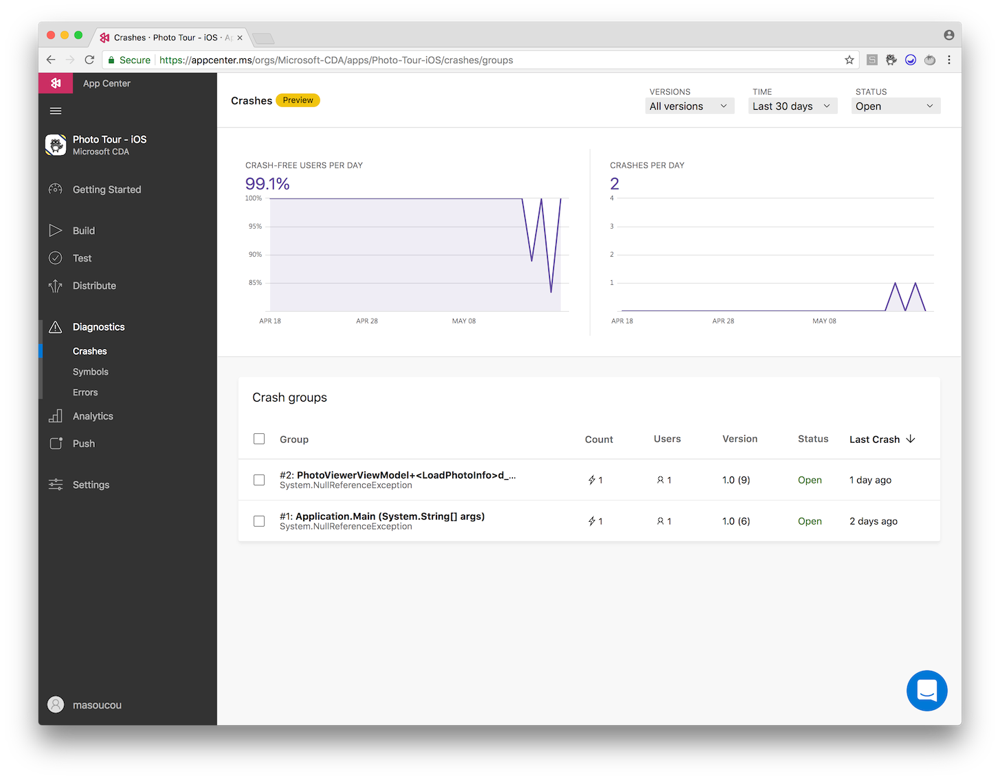
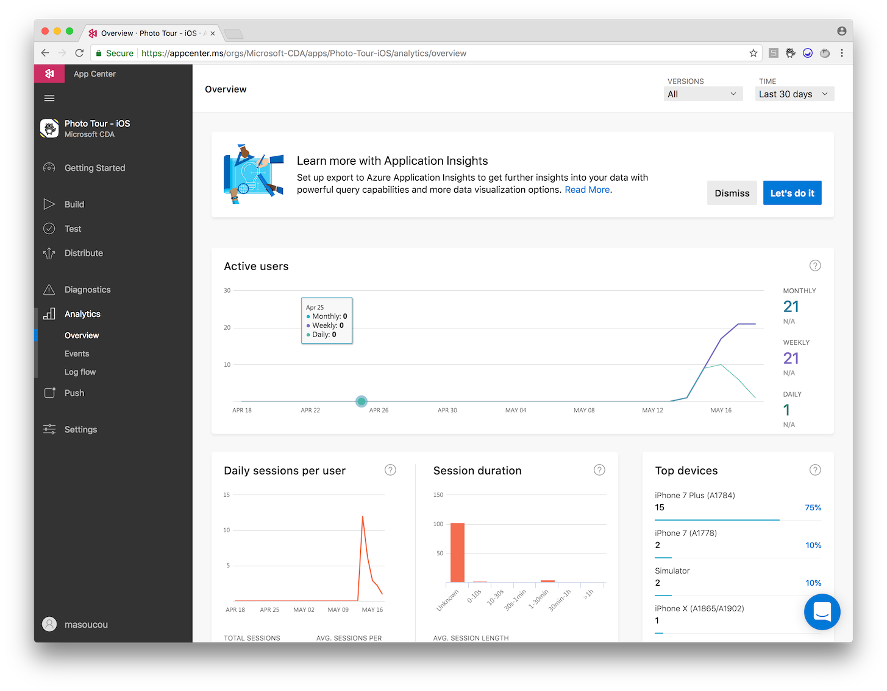
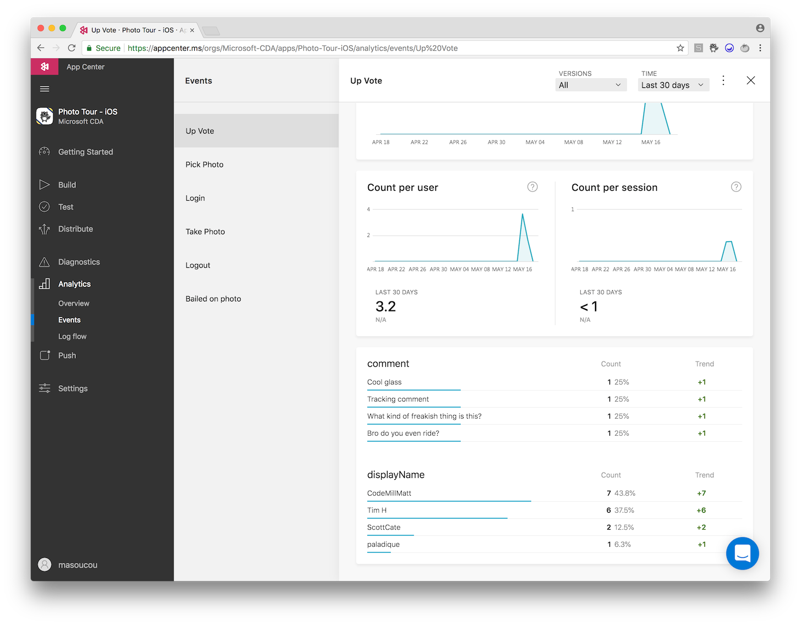

# Azure + Xamarin = 🚀

Let's build Photo Tour as a mobile app! We'll harness the power of Azure and the native device capabilities of both iOS and Android to build, track analytics and crash reporting, and distribute, all from a single code base built with Xamarin.

## Azure Offerings Demoed

* Azure AD B2C
* Azure BLOB Storage
* Azure Cosmos DB with MongoDB API
* App Center

## Talk Track

### Main Talking Points

Throughout the slides and demo - these are the points that you want to drive home.

* Xamarin lets you create native mobile apps that access unique features of each operating system and device.
* Xamarin.Forms abstracts common controls each operating system has into a single API to speed overall development time.
  * Forms also has a built-in MVVM framework that provides things like data binding which reduces the amount of code even further.
* Because everything is written w/ .NET you can create a reusable app logic layer that takes advantage of NuGet & .NET features (LINQ, generics, etc.) even though you're targeting non-Microsoft OS's.
  * Integration with Azure w/ those NuGets is straight-forward and lets you create a serious, full-featured, cloud enabled app in 30 minutes. (At least in demo-world).
* The .NET everywhere mindset even lets developers successfully mix frameworks that are uncommon like .NET and MongoDB.
* App Center is Microsoft's new one-stop mobile hub. Its features include the ability to build apps from source (GitHub, VSTS, Bitbucket), distribute automatically to testers, automatically inspect crash reports, and view analytics.

## Demonstration Overview

You're going to be showing 4 Azure services - Azure AD B2C to log in, Azure BLOB Storage, Azure Cosmos DB w/ MongoDB API, and App Center.

Also you'll be calling out Xamarin.Forms and how you're creating a native iOS and Android app from a single codebase - all the while accessing the native capabilites of the device.

You can run the app in one of 3 ways, ordered from easiest to most difficult:

* Have the app pre-installed on your iOS or Android device & mirror (Reflector or Vysor) that to the demo computer. Just point out code as you talk through the app.
  * This is the easiest setup and allows you to not have to worry about provisioning devices, getting Apple accounts, setup, etc.
* Run the app through Visual Studio Mac on the iOS simulator.
  * Downside is that you will not have access to a camera on the simulator and will need to pick photos from the Photo Library.
  * Running on Android emulator is not recommended due to constraints of Android OS within the emulator.
* Run the app on device (mirror to screen) while debugging through the IDE.
  * Most impressive demo. Allows you to have full access to the device features - and also hit any breakpoints while explaining the code.

### Solution Setup

Here is how the code in the solution is setup so you can get familiar with where everything is:

* All the code that will be demoed is located in the `PhotoTour.Core` project.
* Everything that communicates with Azure is located in the `Services` folder.
  * `IdentityService` => Azure AD B2C
  * `MongoDataService` => Azure Cosmos DB w/ MongoDB API
  * `StorageService` => Azure BLOB Storage
* Code that accesses the camera is located in the `ViewModels` folder `PhotoListViewModel`
* New Xamarin.Forms 3.0 code announced at Build is located in `Pages` folder `PhotoListPage.xaml` and `PhotoListPage.xaml.cs`
* Data binding code is located in `Pages`, `PhotoViewPage.xaml`

### App Center Setup

### Part 1: Walk through of the app

Today we're going to build a mobile app that's cloud enabled with as little code as possible using Xamarin and the power of .NET Standard that, which if libraries adhere to, will allow them to run across different operating systems.

All the code, including the UI code, is all located in a .NET Standard library. Meaning each operating system is reusing the same code - there is no duplication of any logic.

### Part 2: Xamarin.Forms XAML UI

Shows easy it is to build up a UI using Xamarin.Forms.

* Quick walk through of solution setup.
  * iOS project
  * Android project
  * Core project
* Other than boilerplate startup code, everything we're doing is within the Core project.
  * This means a 100% native iOS or Android app from a single code base.

* Open `PhotoListPage.xaml`
    * Notice image grid on the app's opening page the It was very difficult to build something like this previously, but at Build, Xamarin.Forms 3.0 was released and it included a `FlexLayout`.
    * `FlexLayout` takes any child controls and automatically arranges them on-screen into a great looking UI. Previously doing a grid layout like that photo list was code consuming and time consuming. Now it's just this:

### Part 3: Xamarin.Forms MVVM / Data Binding

Another feature that Forms provides to speed development is an MVVM framework.

* MVVM = Model, View, ViewModel (just like MVC, but more V's and more M's)
* Data binding plays a big part in MVVM - let's you "bind" a control on the UI to a property in the view model.
  * Whenever the value is changed in one, it automatically updates the other.
* Open `PhotoViewPage.xaml` show line 69 the `Text` property.
  * This is used for holding the comment text.
* _(Optional: If debugging)_ Set a breakpoint within `PhotoViewerViewModel.ExecuteSaveCommand` and then save a new comment.
  * Shows the how the property `PhotoViewViewModel.NewComment` already has the value entered into the text box. It was automatically updated.

### Part 4: Azure Cosmos DB w/ MongoDB API

The comments are all saved to a MongoDB in Azure Cosmos DB.

When you think of .NET developers - what database do you think of? What about Cloud databases? SQL Server probably. A mantra of Microsoft is "Any Developer, Any App, Any Platform". And that's certainly true when it comes to MongoDB and .NET.

MongoDB is a document database - not relational. It's open source. And it's usually associated with node and web apps. But we can just as easily use it within a Xamarin app - and thus iOS and Android - through Azure Cosmos DB and some great NuGet packages.

* Open `MongoDataService.GetAllPhotos`.
  * This is the function that is returning all of the photos from the MongoDB instance. Notice that the library even provides asynchronous operations - which is very important in mobile development so we don't block the UI!
* Show `MongoDataService.FindPhotoByUrl`
  * But because this is .NET, we've become accustomed to great features like LINQ - and we can do that with the Mongo library too!
* Open `Comment`
  * The model class that contains all of this information is just a CLR object decorated with some Mongo attributes telling it these are Mongo properties.

### Part 5: Azure AD B2C

Identity is something that's notriously hard to accomplish. There is OAuth flows, OpenID Connect, managing tokens, caching of tokens, and so on. Not to mention logging in with social providers like Twitter, Facebook, etc.

 But the Azure AD B2C team has created a library to do all of that for us and it's available via NuGet. It's called the Microsoft.Identity.Client.

* Show the code in `IdentityService`
  * Line 57 shows how the login is done
  * Line 95 shows how cached credentials are retreived
* Azure AD B2C hides the details of communicating to Twitter (and handles other ID providers like facebook, Github, etc). It puts users in an Active Directory. Issues tokens.
* The Microsoft.Identity.Client handles the difficult work of communicating to AD B2C & caching.
* .NET Standard do the rest making login cross platform w/ code sharing from a single spot.

### Part 6: Azure Storage + Xamarin Device Functionality

The last thing we'll show is how to access the unique features of each device from the shared code. And that's getting at the camera.

* **Take a photo**
* Here's what all happened - open `PhotoListViewModel` and go to line 166.
  * Using a Media plugin - it gets the device's camera capability through an abstraction.
  * The Media plugin handled all the dirty work for me. All I needed to do was:
    * `IsTakePhotoSupported` and `IsCameraAvailable` to see if my device is currently able to snap a photo.
    * Then further down the line, `TakePhotoAsync` - that's all there is to snap a photo.

* Uploading to BLOB storage is wrapped in another great NuGet package that runs on multiple operating systems!
* Open `StorageService`
* Line 24 does the upload
  * After getting a reference to the storage account and the container in which the BLOB resides, the only line of code that matters is `UploadFromStreamAsync`.

### Part 7: App Center

We also have a powerful means of building, distributing, and tracking analytics and crashes of mobile apps - and that's App Center.

* In line 185 of `PhotoListViewModel` - you may have noticed these `Analytics.TrackEvent` functions littered about.
* Open appcenter.ms in the browser.
* You can connect App Center to various source control repos and have the solution build and unit tests run on pushes against various branches (or manually).
* UI Tests can also be setup to run against real devices.
* Look how uncaught crashes are caught by showing the **crashes** tab.
  * 
* Overall analytics - including session durations, device types, etc are shown in the **analytics->overview** tab.
  * 
* Individual events are being tracked in the **analytics->events** tab
  * 

## Demo Setup

In order compile anything for iOS, you need a Mac, that's the way it is. While Xamarin offers a solution to build iOS on Windows, it still flow through a Mac. That means 2 machines on stage, which is probably overkill for the 30 minutes alloted. So use a Mac. 😁

The first 3 steps listed are only for a machine that does not have the Xamarin workload and iOS certificates already installed. If your machine already does and you can successfully debug on device, feel free to skip to step number 4.

### 1. Installing Xamarin

All the demos are designed to be shown with Visual Studio. 

_You only need to do this step once, ideally way, way, way before the show date._

* Install XCode from the Apple **Mac** App Store.
* These are the [best instructions](https://docs.microsoft.com/en-us/visualstudio/mac/installation?WT.id=azuredevtour-github-masoucou), hands down, on installing Visual Studio for Mac. The instructions also address the Xamarin workload.
  * __Note:__ All further 3rd party dependencies dependencies, including the Android SDKs will be installed.
* Once everything is installed, launch Visual Studio and sign-in with your Microsoft credentials. _This is not necessary to run the demos, but cleans up the overall look._

Next step is to get the iOS provisioning setup.

### 2. iOS Setup

**If you are only demoing on the simulator (not a real device) you do not need to do this step.**

Now we need to tell Visual Studio for Mac (and XCode under the covers) what our Apple Developer account is, so it can go through the process of creating certificates and associating your device ID with that certificate into what's known as a provisioning profile, download it, so you can successfully debug/demo on device. Yeah seriously, there's a ton of steps for iOS development.

**The One Time Only Steps Per Machine:**

* Install the *fastlane* toolset. The [documentation](https://docs.microsoft.com/en-us/xamarin/ios/deploy-test/provisioning/fastlane/index?WT.id=azuredevtour-github-masoucou#installation) is here and it's great.
  * You only need to follow the steps in the _Install_ section.
* Add the CDA Apple Developer Account to Visual Studio Mac. [Docs are here](https://docs.microsoft.com/en-us/xamarin/cross-platform/macios/apple-account-management?WT.id=azuredevtour-github-masoucou&context=xamarin%2Fios&tabs=vsmac).
  * You should only need to follow the _Adding an Apple developer account_ section.
* Open the solution `azuredevtour\xamarin\PhotoTour.sln` in Visual Studio Mac.
* Finally, enable automatic provisioning. [Docs are here](https://docs.microsoft.com/en-us/xamarin/ios/get-started/installation/device-provisioning/automatic-provisioning?tabs=vsmac).

**Setup Every Time a New Device Is Plugged In:**

* Plug your device into the Mac via USB. (Yay - that's it!)

### 3. What About Android?

Assuming all went well with step #1, you shouldn't have to do anything further to get Android to work.

#### iOS Simulator

* From the dropdowns across the top toolbar (right next to the play button, they don't look like dropdowns at first glance), select the following:
  * Reviewer.iOS
  * Debug | iPhoneSimulator
  * iPhone X 11.3 _(note the 11.3 may be different by the time you read this depending on Apple's SDK upgrade cycle.)_
* Hit the play button. The app should start within an iPhone X simulator.